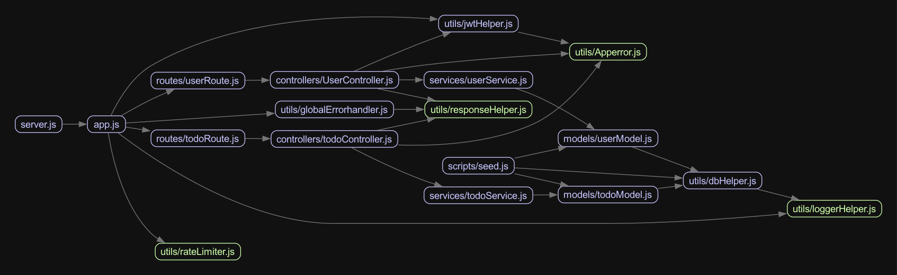
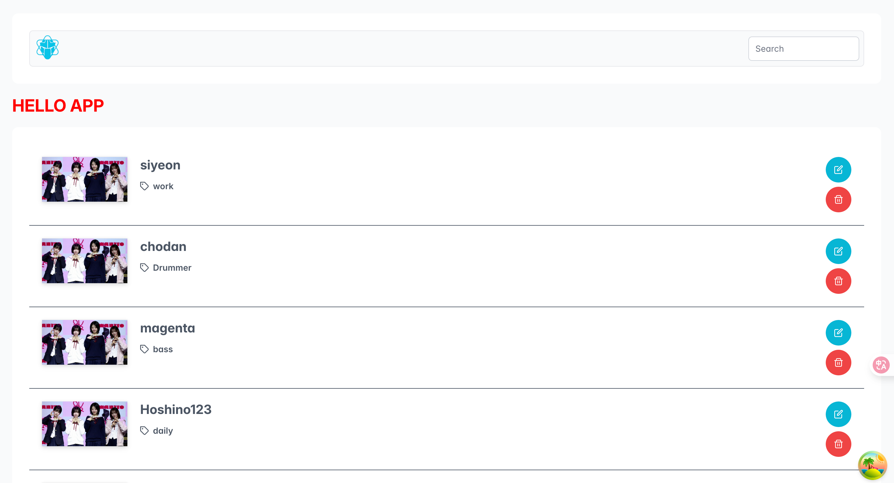
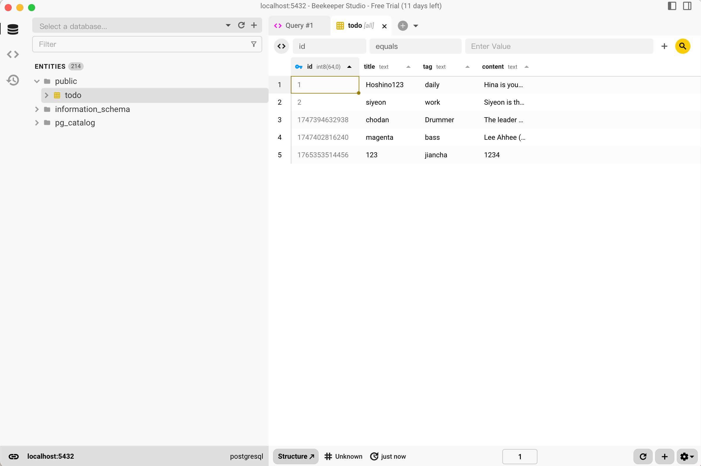
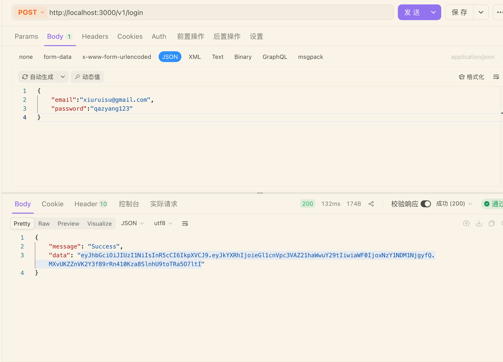
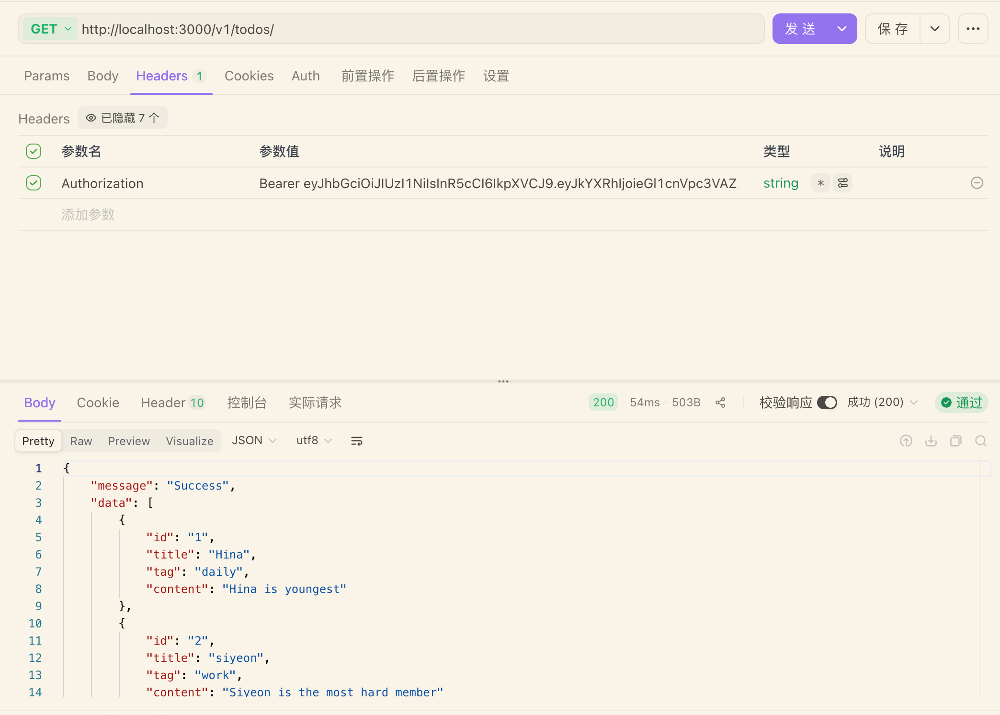

2025 年 12 月 10 日

Web Page

Database

Auth_JWT_token



# TODO 検索アプリ

## 概要

- `backend-app` は Express + Sequelize で構築した REST API。PostgreSQL を想定し、Todo（`id`, `title`, `tag`, `content`）の CRUD とページング・簡易サーチを提供。
- `frontend-app` は Vite + React 19 + PrimeReact。React Query と Jotai を使い、API と連携した一覧表示、検索、ページング、追加/編集/削除をサポート。
- `.env` と `.env` (frontend) で接続先とページサイズを切り替え可能。
- ロギング（Pino）とレートリミット（10 req/sec, /v1 配下）が有効。

## ディレクトリ

- `backend-app/src` … `app.js`（ミドルウェア設定）、`routes/todoRoute.js`（REST ルート）、`controllers`/`services`（業務ロジック）、`models/todoModel.js`（Sequelize モデル）、`utils`（DB/ログ/エラーハンドラ/RateLimit）、`scripts/seed.js`（初期データ投入）。
- `frontend-app/src` … React コンポーネント（`TodoList`/`TodoDialog` など）、状態管理（`atoms`）、API クライアント（`service/apiTodo.ts`）、フック群（`hooks/todo/*`）、スタイル（`assets`）。

## 動作要件

- Node.js 18 以上推奨
- pnpm 10 系（`packageManager: pnpm@10.6.5` 記載）
- PostgreSQL（ローカルで `DB_HOST=localhost` 前提の `.env` あり）

## セットアップ & 起動

1. リポジトリ直下でそれぞれ依存を導入

```bash
cd backend-app && pnpm install
cd ../frontend-app && pnpm install
```

2. バックエンド環境変数（`backend-app/.env`）を確認・編集

```
DB_NAME=postgres
DB_USER=postgres
DB_PASSWORD=123456
DB_HOST=localhost
DB_PORT=5432
PORT=3000
```

必要に応じて DB を作成し、PostgreSQL を起動しておく。

3. サンプルデータ投入（任意）

```bash
cd backend-app
pnpm seed   # src/scripts/data/initData.json を todo テーブルに全件投入（force sync）
```

4. バックエンドを起動

```bash
cd backend-app
pnpm dev    # nodemon + pino-pretty, http://localhost:3000
```

5. フロントエンド環境変数（`frontend-app/.env`）を確認

```
VITE_BASE_URL=http://localhost:3000/v1/todos
VITE_PAGE_SIZE=5
```

6. フロントエンドを起動

```bash
cd frontend-app
pnpm dev    # デフォルト http://localhost:5173
```

## API（/v1 プレフィックス）

- `GET /todos?page={n}&limit={n}&search={text}`: Todo 一覧取得（ページング/タイトル検索）。レスポンス `{ message, data: Todo[] }`
- `GET /todos/{todoId}`: 単一取得。`data: Todo`
- `POST /todos`: 新規作成。Body: `{ id, title, tag, content }`
- `PATCH /todos`: 更新。Body: `{ id, title?, tag?, content? }`
- `DELETE /todos/{todoId}`: 削除
- `GET /todos/count?search={text}`: 件数取得（ページネーション用）
- 共通レスポンス: `message` と `data`（存在する場合）。見つからない場合は 404。
- レートリミット: `/v1` へのリクエストは 1 秒 10 件まで。
- ログ出力: `src/logs/all-logs.log` ほか warn/error 専用ファイルを Pino が生成。

## フロントエンド挙動

- 検索バー（Menubar 内 InputText）入力 → React Query のクエリキーに反映し、`search` クエリ付きで再取得。
- DataView にカード表示（PrimeReact）。削除ボタンで API 呼び出し → React Query のキャッシュ無効化。
- `Add` ボタン、または各行の編集ボタンで `TodoDialog` を表示。Add/Update はフォーム送信で POST/PATCH。完了時は Toast 通知。
- ページネーション: `Paginator` が `/todos/count` を参照し、`VITE_PAGE_SIZE` を行数として切り替え。
- 状態管理: Jotai（ローディング状態、編集対象、ダイアログ表示フラグなど）、React Query（サーバー状態）で分離。

## よくある作業

- モデル定義: `backend-app/src/models/todoModel.js`（テーブル名 `todo`, timestamp 無効）。ID はクライアント生成の数値/文字列を想定。
- 初期データ編集: `backend-app/src/scripts/data/initData.json` を修正して `pnpm seed`。
- アーキ図: `backend-app/architecture.png`（参考）。

## トラブルシュートのヒント

- DB 接続確認: サーバー起動時に `✅ Connection has been established successfully.` が出ない場合、`.env` と DB 起動状態を確認。
- CORS/ポート衝突: フロントとバックのポートが競合しないように `PORT` を調整。
- ログ: 問題発生時は `backend-app/src/logs/*.log` を参照。

# TODO 搜索应用

## 概要

- `backend-app`：Express + Sequelize 的 REST API（PostgreSQL 预设），提供 Todo（`id`, `title`, `tag`, `content`）的 CRUD、分页与搜索。
- `frontend-app`：Vite + React 19 + PrimeReact；用 React Query + Jotai 做服务端/本地状态管理，支持列表、搜索、分页、添加/编辑/删除。
- 环境变量可在后端/前端的 `.env` 中切换；后端启用 Pino 日志与 1 秒 10 次的 `/v1` 速率限制。

## 目录结构

- `backend-app/src`：`app.js`（中间件）、`routes/todoRoute.js`（路由）、`controllers`/`services`（业务逻辑）、`models/todoModel.js`（Sequelize 模型）、`utils`（DB/日志/错误/限流）、`scripts/seed.js`（初始化数据）。
- `frontend-app/src`：组件（`TodoList`/`TodoDialog` 等）、状态原子（`atoms`）、API 客户端（`service/apiTodo.ts`）、hooks（`hooks/todo/*`）、样式（`assets`）。

## 环境要求

- Node.js 18+
- pnpm 10.x（`packageManager: pnpm@10.6.5`）
- PostgreSQL（`.env` 默认 `localhost`）

## 安装与启动

1. 安装依赖

```bash
cd backend-app && pnpm install
cd ../frontend-app && pnpm install
```

2. 配置后端环境变量 `backend-app/.env`

```
DB_NAME=postgres
DB_USER=postgres
DB_PASSWORD=123456
DB_HOST=localhost
DB_PORT=5432
PORT=3000
```

确认数据库已创建并启动。

3. （可选）导入示例数据

```bash
cd backend-app
pnpm seed   # 使用 src/scripts/data/initData.json，强制重建 todo 表
```

4. 启动后端

```bash
cd backend-app
pnpm dev    # http://localhost:3000
```

5. 配置前端环境变量 `frontend-app/.env`

```
VITE_BASE_URL=http://localhost:3000/v1/todos
VITE_PAGE_SIZE=5
```

6. 启动前端

```bash
cd frontend-app
pnpm dev    # 默认 http://localhost:5173
```

## API（前缀 /v1）

- `GET /todos?page={n}&limit={n}&search={text}`：分页/搜索获取列表，响应 `{ message, data: Todo[] }`
- `GET /todos/{todoId}`：获取单条
- `POST /todos`：新增，Body: `{ id, title, tag, content }`
- `PATCH /todos`：更新，Body: `{ id, title?, tag?, content? }`
- `DELETE /todos/{todoId}`：删除
- `GET /todos/count?search={text}`：获取总数（分页用）
- 响应包含 `message`，有数据时含 `data`；未找到返回 404。`/v1` 路由限流 1 秒 10 次。
- 日志：Pino 输出到 `src/logs/all-logs.log` 以及 warn/error 专用文件。

## 前端行为

- 顶部 Menubar 搜索框变更 → React Query 重新请求，附带 `search` 参数。
- 列表用 PrimeReact DataView 展示；删除后通过 React Query 失效缓存刷新列表。
- `Add` 或行内编辑按钮打开 `TodoDialog`；表单提交调用 POST/PATCH，操作完成后 Toast 提示。
- 分页：`Paginator` 调用 `/todos/count`，行数取 `VITE_PAGE_SIZE`。
- 状态：Jotai 管理 UI/本地状态（加载态、当前编辑项等），React Query 管理服务端数据。

## 常用操作

- 修改模型：`backend-app/src/models/todoModel.js`（表名 `todo`，无时间戳），ID 可由客户端生成。
- 调整初始数据：编辑 `backend-app/src/scripts/data/initData.json` 后运行 `pnpm seed`。
- 架构示意：`backend-app/architecture.png`。

## 故障排查

- 数据库连接失败：检查 `.env`、PostgreSQL 是否启动，以及启动日志中是否出现 “Connection has been established successfully.”。
- 端口/CORS：如端口占用，修改 `PORT`；若跨域异常，确认 `cors` 已启用（`app.js`）。
- 查看日志：`backend-app/src/logs/*.log`。
